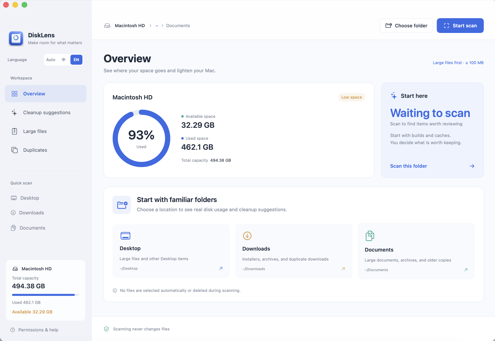

# DiskLens

**English** | [简体中文](README.zh-CN.md)

A native macOS disk analyzer built with Swift 6 and SwiftUI. Start with familiar folders like **Desktop, Downloads, and Documents** to find files worth reviewing. No third-party dependencies; all analysis stays on your Mac.



Its fast scan focuses on large items: by default, it creates candidates only for files and build directories of **100 MB or more** and skips `.git`. It uses macOS-native `fts` traversal and `stat` metadata. Smaller files contribute to usage totals without becoming individual Swift file objects or candidates. Directories such as `node_modules` are grouped into single items.

**See results as they arrive:** large items and completed-directory totals update about every 0.4 seconds, so you need not wait for the entire scan. Stopping a scan keeps partial results for reviewing completed candidates. Partial results are clearly marked and must not be treated as totals for the whole folder. Cleanup is unavailable while a scan is running.

## Getting started

Requires macOS 14+ and Xcode 16+ or a Swift 6 toolchain.

```bash
cd disklens
./scripts/build-app.sh debug
open dist/DiskLens.app
```

You can also open `Package.swift` in Xcode and run DiskLens there. After building, you can launch `dist/DiskLens.app` directly or move it to Applications.

The app supports Simplified Chinese and English. Use **Auto / 中 / EN** at the top of the sidebar to follow your system language or choose a language directly. Your choice is saved, and switching languages does not require another scan.

DiskLens hides unused Edit, Format, and other empty menus. Undo, cut, copy, paste, and select-all shortcuts still work in the search field.

DiskLens uses a new app bundle compared with the old StorageMaster name. If you granted Full Disk Access to StorageMaster, grant it to DiskLens separately if needed.

## How to use

1. Start from **Desktop / Downloads / Documents** on the home screen or sidebar, or choose any folder. The app asks macOS for the standard user-folder locations and initially shows Documents. Shortcuts for unavailable standard folders are hidden.
2. **Overview** shows actual available space on the current volume and the sizes of folders within the scan location. Click a rectangle to scan into it. Click a blue path segment in the header or Space Distribution to jump to a parent folder, or use Back to return to the previous location. These jumps scan the selected folder without reopening the folder picker. Open the **Other** rectangle or **View all** to see the complete size ranking.
3. **Cleanup suggestions** groups items into builds and dependencies, long-unmodified items, installers and archives, caches, and logs. Presentations, videos, and ordinary documents appear under **Large files**; those unmodified for over a year may also appear in suggestions. When there are no suggestions, the app still shows a large-file count and a shortcut to that page. Search by path or name, inspect an item's explanation, and check it in Finder.
4. **Large files** supports 10 MB, 100 MB, and 1 GB thresholds. Changing the threshold starts a new scan. Size alone does not mean a file is safe to remove.
5. **Duplicates** requires a separate comparison. It considers only files above the current scan threshold, groups them by size, then reads them in chunks and computes SHA-256 hashes. The first copy in each group is suggested for keeping; select other copies manually. Selections made on other pages persist, so check the total selected count and confirmation list.
6. Select files and choose **Move to Trash**. Review their full paths and warnings before confirming. **Moving files to Trash does not immediately free disk space; empty the Trash in Finder after checking its contents.**

Large files, cleanup candidates, and the **View all** directory list show creation and modification dates. Hover over a date to see the time; item details show the full timestamp. A directory's **latest modification** in lists and the map includes its own timestamp and those of all scanned descendants, even files below the size threshold. Details and map tooltips also show the directory's own modification time. Times use the current system time zone and already-scanned metadata; no additional traversal is needed. Missing creation times appear as `—`.

**Long-unmodified items:** candidates must meet the current size threshold and have a last-modified time earlier than one year before the scan began. A directory must be fully scanned, contain no protected content, and have every item inside older than a year. The current scan root and standard folders such as Documents and Downloads are not suggested as whole-folder candidates. This checks modification time, not the last time a file was opened or used. Old documents, archives, and backups may still matter and are never preselected.

Large files within long-unmodified directories remain discoverable under **Large files**. Categories and search can reveal their candidates, and categories may overlap. Suggestion and selection totals deduplicate parent and child paths. Existing cache, build, and installer categories remain available.

After a successful cleanup, the app updates the in-memory scan incrementally without automatically scanning again. It removes trashed items, adjusts file counts and directory sizes, updates duplicate groups, and keeps the current page, search, category, sort order, and selections that failed to move. Use **Rescan** to incorporate changes made by other apps. The sidebar always shows the volume's total, used, and available space; moving items to Trash is not counted as newly available disk space. Returning from Finder or another app refreshes volume-capacity figures only, not the folder scan.

The app scans one location at a time. Scanning a parent already includes its children, so do not add the results of parent and child scans together. Switching locations clears the previous results and selections.

## What it recognizes

- Development artifacts: `node_modules`, `.build`, `__pycache__`, `.next`, `.nuxt`, `.parcel-cache`; Rust `target` directories in projects with `Cargo.toml`; `.venv` directories containing `pyvenv.cfg`; and Xcode `DerivedData` subdirectories.
- Caches: subdirectories of `Library/Caches`.
- Installers and archives: DMG, PKG, ISO, ZIP, 7Z, RAR, TAR, and GZ.
- Logs: `.log` files.
- File and directory candidates must occupy at least 100 MB by default. Duplicate comparison uses the current threshold, which you can change to 10 MB or 1 GB on the Large files page. Grouped build directories do not also expose their contents as large files or duplicates, avoiding double counting.
- Generic `build` and `dist` directories, and `target` directories without a Rust project marker, are not automatically classified as build artifacts.

Installers, archives, logs, and generated directories can still be valuable. Categories are prompts for review, not a judgment that an item is disposable. Nothing is preselected.

## File safety and accounting

- Scans read metadata only; duplicate comparison is the only operation that reads file contents. There are no network requests, cloud uploads, or administrator-permission requests.
- Symbolic links are not followed, other devices or volumes are not traversed, and iCloud files not downloaded locally are skipped. A directory that cannot be fully read is not suggested as a whole-folder cleanup candidate.
- `.git` directories and worktree markers are skipped and excluded from fast-scan usage totals. System paths, app bundles, photo and music libraries, Trash, and sensitive non-cache Library data are not suggested as candidates, though readable data still counts toward usage. Build directories containing protected data or `.git` are not suggested as a whole.
- The scan root, home directory, and standard folders such as Documents and Downloads cannot themselves be cleaned.
- Before moving an item, DiskLens checks path boundaries, symbolic links, file identity, size, modification time, and status-change time. It recursively verifies directory metadata fingerprints and refuses items changed since scanning. This verification is not an atomic filesystem transaction; quit apps using the selected files first.
- DiskLens only calls macOS `trashItem` and offers no permanent-delete feature. Failures are reported per item. Successful moves update the current scan cache without retraversing the directory. Unmoved items retain their original metadata fingerprint and are checked again before a later cleanup.
- Local usage is estimated with `st_blocks × 512`. Hard links are counted once per device and inode and are not listed as separate candidates. A build directory with hard links may not free exactly its displayed size. Small loose files below the threshold are combined on the map.
- APFS clones and shared blocks, compression, snapshots, purgeable space, and privacy permissions can make scan figures differ from macOS Storage settings. Volume capacity and scanned-folder usage are displayed separately; numbers are not a promise of recoverable space.
- Permission failures, cloud files, and cross-volume skips show counts and some paths. If needed, add the packaged DiskLens app under **Privacy & Security → Full Disk Access**, then relaunch it.

## Development and verification

```bash
swift test -j 4
./scripts/build-app.sh debug
# Start a read-only scan of a chosen folder
open dist/DiskLens.app --args --scan "/path/to/folder"
```

Project layout:

```text
Sources/StorageCore/       Scanning, path policy, duplicates, and Trash service
Sources/StorageTraversal/  Native macOS fast traversal (C, system library)
Sources/StorageMaster/     SwiftUI interface and asynchronous app state
Tests/StorageCoreTests/    Tests for paths, links, changes, and duplicates
Resources/                App metadata and icons
scripts/                  Local .app packaging
```

By default, a `release` build requires a valid Developer ID Application certificate in your keychain and enables Hardened Runtime and a secure timestamp. A `debug` build prefers an Apple Development certificate and otherwise uses ad-hoc signing. The first certificate-signed build may ask you to allow `codesign` to use the keychain private key. If signing fails, the script restores an ad-hoc signature and reports the error. Set `DISKLENS_SIGNING_IDENTITY` to choose a signing identity; `release` still requires Developer ID Application. Publicly distributing an app bundle also requires Apple notarization and stapling; publishing source code does not.

## App icon

`Resources/StorageMasterIcon.png` is a 1024 × 1024 icon with transparent edges. `Resources/StorageMasterIcon.icns` includes sizes for Finder and the Dock. The sidebar uses the same icon.

An editable Swift drawing script generates the blue rounded base, white disk, usage ring, and cleanup sparkle. To export the icon again:

```bash
swift scripts/make-icon.swift .build/StorageMaster.iconset Resources/StorageMasterIcon.png
iconutil -c icns .build/StorageMaster.iconset -o Resources/StorageMasterIcon.icns
./scripts/build-app.sh debug
```
