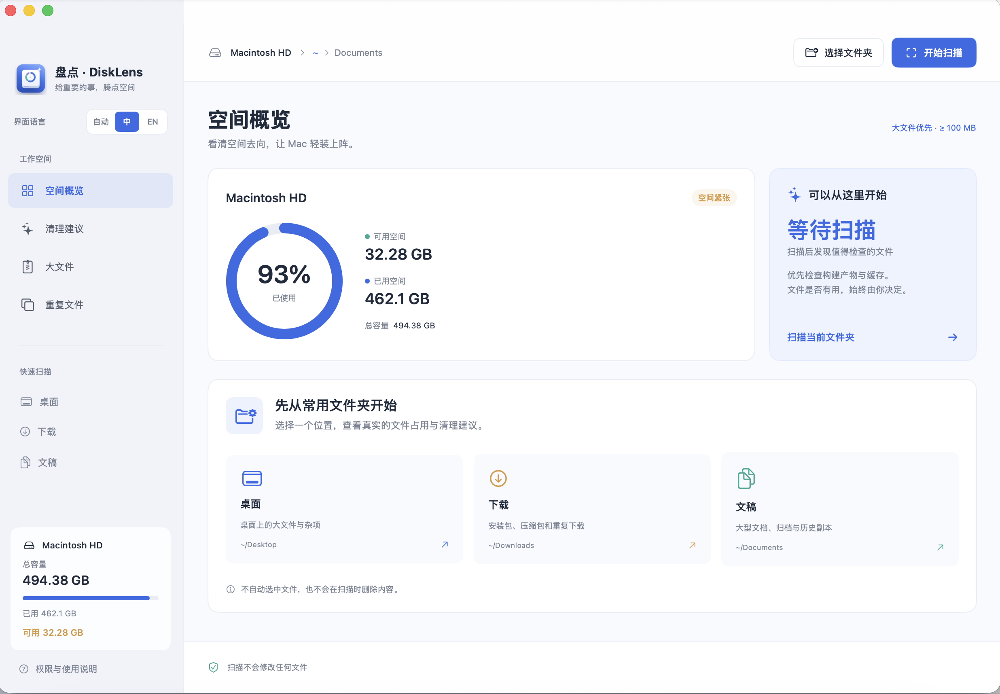

# 盘点 · DiskLens

[English](README.md) | **简体中文**

Swift 6 + SwiftUI 原生 macOS 磁盘分析工具。可从 **桌面、下载、文稿** 等常用目录开始，帮助判断哪些文件值得清理。无需第三方依赖，所有分析在本机完成。



采用「抓大放小」的快速扫描：默认只建立 **100 MB 以上**的文件 / 构建目录候选，跳过 `.git`。底层使用 macOS 原生 `fts` 遍历与 `stat` 元数据；小文件不创建 Swift 文件对象、不进入候选列表，只累计占用。大量小依赖会合并成一个 `node_modules` 等目录项目。

**边扫边看**：约每 0.4 秒更新已发现的大项目和已完成目录的占用，不必等待全盘扫描结束。点击「停止」会保留部分结果，可先检查和清理已完成扫描的候选；部分结果有明确标记，不能当作整个目录的总量。扫描期间不能执行清理。

## 启动

要求 macOS 14+、Xcode 16+ / Swift 6 工具链。

```bash
cd disklens
./scripts/build-app.sh debug
open dist/DiskLens.app
```

也可在 Xcode 中打开 `Package.swift`，选择 DiskLens 运行。首次构建完成后可直接双击 `dist/DiskLens.app`，或把它拖入「应用程序」。

应用提供简体中文和英文界面。点击左侧顶部的「自动 / 中 / EN」可直接切换跟随系统、简体中文和英文；选择会自动保存，切换不需要重新扫描。
应用隐藏无业务用途的「编辑」「格式」及其他空菜单；搜索框仍支持撤销、剪切、复制、粘贴和全选快捷键。
从旧版 StorageMaster 升级时，DiskLens 是新的应用包；如果旧版已获「完全磁盘访问权限」，请按需为 DiskLens 重新授权。

## 使用

1. 选择首页或侧栏的 **桌面 / 下载 / 文稿** 开始扫描，也可选择任意文件夹。应用使用 macOS 返回的用户目录位置，默认显示文稿；不存在的标准目录不显示快捷入口。
2. **空间概览**显示所在卷的实际可用空间，以及扫描目录中各文件夹的占用面积。点击矩形深入扫描；顶部和「空间分布」中的蓝色路径层级可直接点击跳到上级目录，左上角返回上一位置。跳转会扫描所选目录，无需重新打开文件夹选择器。「其他」矩形或「查看全部」可打开完整占用排行。
3. **清理建议**按构建与依赖、长期未修改、安装包与归档、缓存、日志分类。PPT、视频和普通文档显示在「大文件」页，超过一年未修改的也会进入清理建议；没有清理建议时会显示大文件数量和跳转入口，概览也会优先展示这些大文件。搜索路径或文件名，点击文件查看用途提示，在 Finder 中检查。
4. **大文件**可切换 10 MB、100 MB、1 GB 门槛，修改门槛会重新扫描。仅体积大不代表可删除。
5. **重复文件**需要额外点击比对：只比较当前扫描门槛以上的文件，按大小分组，逐块读取并计算 SHA-256。默认建议每组保留第一份，其他文件手动选择。跨页面已有选择会保留，请查看底部选择总数和确认清单。
6. 选择文件，点击「移到废纸篓」，检查完整路径和提示后确认。**移到废纸篓不会立即释放磁盘空间；检查后需要自行在 Finder 清空废纸篓。**

大文件、清理候选和「查看全部」目录列表均显示创建日期与修改日期；悬停时间可查看时分，文件详情也显示完整时间。目录列表和地图显示的「最新修改」取目录自身及内部所有已扫描项目的最新修改时间，包含低于大小门槛的小文件；详情和地图提示中另有目录自身修改时间。时间使用当前系统时区，读取已有扫描元数据，不额外遍历目录；未提供的创建时间显示 `—`。

**长期未修改**：达到当前大小门槛、且最后修改早于扫描开始时的一年前，列为人工检查候选。大目录要求整体完整扫描、没有受保护内容，且所有内部项目均超过一年未修改；当前扫描根目录、Documents / Downloads 等标准目录本身不作为候选。这里判断的是修改时间，不是最后打开或使用时间；旧文档、归档和备份仍可能很重要，不会自动选中。

长期未修改目录中的大文件仍可在「大文件」页查找。分类与搜索可以查看其中的候选，类别之间可能重叠；全部建议和所选容量会合并父子路径，避免重复计算。缓存、构建产物和安装包等已有类别保留。

清理成功后直接增量更新内存中的扫描结果，不自动重新扫描：移除已清理项目，扣减文件数与目录占用，更新重复组，保留页面、搜索、分类、排序和失败项的选择。其他应用造成的文件变化可通过「重新扫描」手动同步。左侧始终显示所在磁盘的总容量、已用与可用空间；移入废纸篓不会被误算为磁盘可用空间增加。从 Finder 等应用切回时，仅刷新磁盘容量计数，不扫描目录。

当前一次扫描一个位置。扫描父目录时已包含其下的子目录，不应把两个扫描结果相加。切换扫描位置会清空旧结果和选择。

## 识别范围

- 开发产物：`node_modules`、`.build`、`__pycache__`、`.next`、`.nuxt`、`.parcel-cache`；有 `Cargo.toml` 的 Rust `target`；含 `pyvenv.cfg` 的 `.venv`；Xcode `DerivedData` 子目录。
- 缓存：`Library/Caches` 的子目录。
- 安装包 / 归档：DMG、PKG、ISO、ZIP、7Z、RAR、TAR、GZ。
- 日志：`.log`。
- 文件和目录候选默认至少实际占用 100 MB，重复比对沿用当前门槛；可在大文件页调整到 10 MB 或 1 GB。构建目录聚合展示，其内部文件不再列入大文件或重复比对，避免重复计算。
- 通用的 `build`、`dist`、名为 `target` 但无 Rust 项目标志的目录不自动作为构建产物识别。

安装包、归档、日志和生成目录也可能有保存价值。分类是检查线索，应用不会替用户判断是否无用，也不会预选文件。

## 文件安全与统计边界

- 扫描仅读取元数据；仅重复比对会读取文件内容。无网络请求，无云端上传，不请求管理员权限。
- 不跟随符号链接；不遍历其他设备 / 卷；跳过未下载的 iCloud 文件。无法完整读取的目录不会作为整体清理候选。
- `.git` 目录 / 工作树标记直接跳过，不计入快速扫描占用。系统路径、应用包、照片 / 音乐图库、废纸篓以及非缓存类的敏感 Library 数据不作为候选，但其可读数据仍计入占用。包含受保护数据或 `.git` 的构建目录不会被整体推荐。
- 不允许清理扫描根目录和个人主目录、Documents、Downloads 等标准文件夹本身。
- 执行前检查路径边界、符号链接、文件身份、大小、修改时间与状态变化时间。目录递归核对元数据指纹，扫描后变化的项目会拒绝执行。检查不是原子文件系统事务，请先退出正在使用所选文件的应用。
- 仅调用 macOS `trashItem`；不提供永久删除功能。移动失败逐项报告；成功后更新当前扫描缓存，不触发目录遍历。未清理项目保留原始元数据指纹，下一次清理前仍逐项校验。
- 采用 `st_blocks × 512` 估算本地占用；硬链接按设备与 inode 计一次，硬链接文件不单独列为候选。包含硬链接的构建目录估计不一定等于实际可释放空间。低于门槛的根目录零散文件在地图中合并展示。
- APFS 克隆共享块、压缩、快照、可清除空间、隐私权限会导致扫描值与系统存储设置不同。卷容量与扫描目录占用分别显示；数字不承诺实际可回收量。
- 权限、云文件或跨卷跳过项会显示数量和部分路径。需要时在「隐私与安全性 → 完全磁盘访问权限」中添加打包后的 DiskLens，再重启应用。

## 开发与验证

```bash
swift test -j 4
./scripts/build-app.sh debug
# 对明确指定的文件夹启动只读扫描
open dist/DiskLens.app --args --scan "/path/to/folder"
```

目录结构：

```text
Sources/StorageCore/       扫描、路径策略、重复查找、废纸篓服务
Sources/StorageTraversal/  macOS 原生快速文件遍历（C，系统库）
Sources/StorageMaster/     SwiftUI 界面与异步状态
Tests/StorageCoreTests/    路径、链接、变化检测、重复识别等测试
Resources/                应用信息与图标
scripts/                  本地 .app 打包
```

默认 `release` 构建要求钥匙串中有效的 Developer ID Application 证书，并启用强化运行时与安全时间戳。`debug` 构建优先使用 Apple Development 证书，若没有则使用 ad-hoc 签名。首次证书签名可能需要允许 `codesign` 访问钥匙串私钥；若签名失败，脚本会恢复 ad-hoc 签名并报错。可通过 `DISKLENS_SIGNING_IDENTITY` 指定签名身份，但 `release` 必须使用 Developer ID Application。公开分发应用包还需提交 Apple 公证并装订凭据；仅发布源码不需要签名或公证。

## 应用图标

`Resources/StorageMasterIcon.png` 是带透明边缘的 1024 × 1024 图标，`Resources/StorageMasterIcon.icns` 包含 Finder / Dock 所需的多种尺寸，应用侧栏也使用同一图标。

图标由可编辑的 Swift 绘图脚本生成：蓝色圆角底板、白色磁盘、分区占用环与清理闪光标记。修改后可重新导出：

```bash
swift scripts/make-icon.swift .build/StorageMaster.iconset Resources/StorageMasterIcon.png
iconutil -c icns .build/StorageMaster.iconset -o Resources/StorageMasterIcon.icns
./scripts/build-app.sh debug
```
